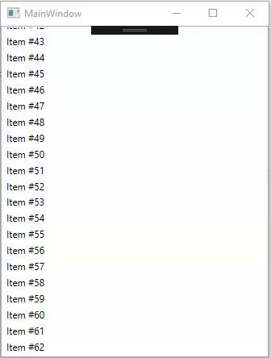

# ScrollBar-WPF
Style for WPF scroll bar, that have some states:
 * Hidden - when Mouse is outside of ScrollViewer
 * Visible (Minimized) - when mouse over ScrollViewer but outside ScrollBar
 * Visible (Normal) - when mouse over ScrollBar
 
## Overview



### Preparation

Add ResourceDictionary to App.xaml.

```xml
<Application.Resources>
  <ResourceDictionary Source="pack://application:,,,/ScrollBar.Style;component/Dictionary.xaml"/>
</Application.Resources>
```

## License

[MIT License](LICENCE)
